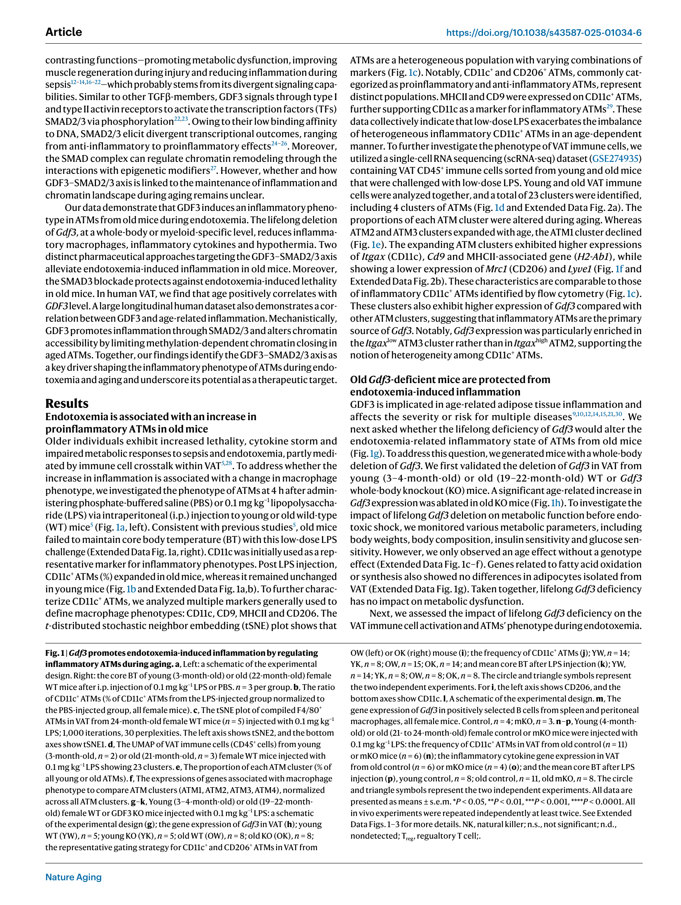

# 《GDF3通过改变衰老过程中的染色质可及性促进脂肪组织巨噬细胞介导的炎症》文献解读

**原文标题**: GDF3 promotes adipose tissue macrophage-mediated inflammation via altered chromatin accessibility during aging

**发表期刊**: Nature Aging

**发表时间**: 2025年12月15日

**DOI**: [10.1038/s43587-025-01034-6](https://doi.org/10.1038/s43587-025-01034-6)

**作者**: In Hwa Jang, Christina D. Camell, 等

---

## 摘要

衰老的一个显著特征是慢性、低度炎症水平的升高，这一现象被称为“炎性衰老”（inflammaging）。这种状态与多种老年病的发生发展密切相关，包括感染易感性增加和代谢紊乱。脂肪组织，特别是内脏脂肪组织（VAT），是衰老过程中最早表现出免疫激活的器官之一，并被认为是驱动全身性炎症的关键“免疫水库”。脂肪组织巨噬细胞（ATMs）是其中的关键角色，它们在衰老过程中会转变为促炎状态，但其背后的具体分子机制尚不完全清楚。

本研究揭示了一个关键机制：衰老的ATMs通过自分泌（autocrine）的**GDF3–SMAD2/3信号通路**来维持其促炎表型，并最终加剧了内毒素血症的严重程度。研究发现，GDF3（生长分化因子3），一种TGF-β家族的细胞因子，其在ATMs中的表达随年龄增长而显著上调。通过在小鼠模型中进行全身性或髓系特异性的Gdf3基因敲除，研究人员发现这能有效减轻内毒素诱导的炎症反应。进一步的药理学干预实验也证实，调控GDF3–SMAD2/3轴能够调节ATMs的炎症表型和内毒素血症的致死率。

机制上，研究通过单细胞RNA测序（scRNA-seq）和ATAC-seq（转座酶可及性染色质测序）等高通量技术分析，发现GDF3通过限制依赖于甲基化的染色质压缩，改变了染色质的可及性，从而诱导细胞向炎症状态转变。最后，研究团队利用来自“社区动脉粥样硬化风险研究”（ARIC）队列的11,084名参与者的人体脂肪组织样本和数据，验证了GDF3在人类衰老过程中的相关性。

这些发现将GDF3–SMAD2/3轴定位为衰老相关染色质重塑和巨噬细胞炎症的关键驱动因素，为干预和缓解衰老相关的炎症性疾病提供了新的潜在治疗靶点。

## 研究背景与关键问题

随着全球人口老龄化，理解衰老的生物学机制变得至关重要。慢性炎症是衰老的核心标志之一，它与心血管疾病、神经退行性疾病、2型糖尿病等多种老年常见病有关。脂肪组织在衰老过程中扮演了复杂的角色，它不仅是能量储存器官，更是一个活跃的内分泌和免疫器官。衰老的脂肪组织会积累大量促炎性的免疫细胞，特别是ATMs，这些细胞通过激活NLRP3炎症小体等途径，持续产生炎症因子，造成组织功能障碍。

然而，衰老的ATMs是如何维持其“促炎记忆”和功能的？这个关键问题仍有待解答。GDF3作为一种多效能的细胞因子，曾被报道与心肌梗死、肥胖和败血症等多种疾病相关，但其在衰老和免疫调节中的具体作用，尤其是在ATMs中的功能，一直不明确。本研究的核心目的就是阐明GDF3在衰老相关的ATMs炎症表型维持中所扮演的角色及其分子机制。

## 核心发现与解读

### 1. 内毒素血症加剧了老年小鼠中促炎性ATMs的失衡

为了模拟老年个体在感染时更易出现严重炎症反应的现象，研究人员给年轻（3-4月龄）和年老（19-22月龄）的野生型（WT）小鼠腹腔注射低剂量的脂多糖（LPS），一种革兰氏阴性菌细胞壁的主要成分，以诱导内毒素血症。结果显示，与年轻小鼠相比，年老小鼠在LPS攻击后表现出更严重的低体温，这是内毒素血症严重程度的一个指标（图1a）。

*图1a：实验设计及LPS注射后小鼠体温变化。老年小鼠（Old）相比年轻小鼠（Young）体温下降更显著。*

流式细胞术分析显示，LPS处理后，老年小鼠VAT中的**CD11c+ ATMs**比例显著增加（图1b）。CD11c是促炎性巨噬细胞的常用标志物。这表明衰老使得ATMs在应对炎症刺激时更倾向于极化为促炎表型。

*图1b, 1c：老年小鼠VAT中CD11c+ ATMs比例在LPS刺激后增加，t-SNE分析显示ATMs的异质性。*

为了更深入地探究ATMs的表型变化，研究者利用scRNA-seq技术分析了LPS处理后年轻和年老小鼠VAT中的所有免疫细胞（CD45+细胞）。他们识别出23个细胞簇，其中包括4个不同的ATM簇（ATM1-4）（图1d）。在衰老过程中，ATM2和ATM3簇的比例显著增加，而ATM1簇则减少（图1e）。重要的是，扩张的ATM2和ATM3簇高表达促炎相关基因，如Itgax (编码CD11c)、Cd9和MHC-II相关基因，同时低表达抗炎相关基因Mrc1 (编码CD206)和Lyve1（图1f）。这一结果从单细胞转录组层面证实了衰老过程中ATMs向促炎状态的转变。

一个关键的发现是，这些促炎性的ATM簇（尤其是Itgax-low的ATM3）高表达**Gdf3**基因，暗示GDF3可能是驱动ATMs炎症表型的主要来源和关键调控因子。

*图1d, 1e, 1f：单细胞图谱展示了VAT中免疫细胞的组成，以及不同ATM亚群在年轻和年老小鼠中的比例和基因表达特征。*

### 2. Gdf3基因缺失可保护老年小鼠免受内毒素血症诱导的炎症

为了验证GDF3在衰老炎症中的关键作用，研究团队构建了Gdf3全身性基因敲除（KO）小鼠。他们发现，Gdf3的表达在年老WT小鼠的VAT中显著高于年轻小鼠，而在KO小鼠中则完全消失，验证了模型的成功（图1h）。在不进行LPS处理的稳态下，Gdf3的缺失对小鼠的体重、体脂成分、胰岛素敏感性等代谢指标没有显著影响，说明Gdf3主要在应激或衰老条件下发挥作用。

*图1g, 1h：Gdf3 KO小鼠模型构建及VAT中Gdf3表达验证。*

然而，在LPS攻击后，情况发生了显著变化。年老的Gdf3 KO小鼠相比年老的WT小鼠，其VAT中促炎性CD11c+ ATMs的比例显著降低（图1j），同时体温下降的幅度也明显减小（图1k），表明其炎症反应得到了有效缓解。

*图1i, 1j, 1k：Gdf3缺失显著减少了老年小鼠VAT中促炎性ATMs的比例，并改善了LPS诱导的低体温。*

为了进一步确认这一作用是由免疫细胞（特别是髓系细胞）中的Gdf3介导的，研究者还构建了髓系特异性Gdf3敲除（mKO）小鼠。结果与全身性敲除类似：年老的mKO小鼠同样表现出VAT中炎症因子（如Il1b, Il6, Tnfa）表达的降低和对LPS诱导的低体温的抵抗（图1o, 1p）。这些结果强有力地证明，髓系细胞（主要是巨噬细胞）来源的GDF3是驱动衰老相关炎症和内毒素血症恶化的关键因素。

*图1l-p：髓系特异性敲除Gdf3（mKO）同样能减轻老年小鼠的炎症反应。*

---
*(后续内容将继续解读GDF3-SMAD2/3信号轴的调控、染色质重塑机制以及人体研究的验证部分)*

### 3. GDF3通过SMAD2/3信号轴和BRD4调控炎症

研究团队进一步探究GDF3下游的信号通路。作为TGF-β家族成员，GDF3已知可以通过磷酸化SMAD2/3蛋白来传递信号。实验证实，在LPS处理的年老WT小鼠VAT中，pSMAD2/3（磷酸化，即激活形式）的水平显著升高，而在Gdf3 KO小鼠中则没有这种升高（图2i），直接证明了GDF3对SMAD2/3信号的激活作用。

*图2i：GDF3缺失抑制了老年小鼠VAT中SMAD2/3的磷酸化激活。*

接下来，他们探索了上游调控GDF3的机制。BRD4是一种表观遗传阅读器，能调控基因转录。使用BRD4抑制剂JQ1处理年老小鼠后，研究者发现VAT中Gdf3的表达显著下降（图2b），同时促炎性CD11c+ ATMs的比例也减少了（图2c），相关的炎症因子表达也受到抑制（图2e）。这表明BRD4是GDF3表达的上游正向调控因子。

*图2a-h：BRD4抑制剂JQ1能有效降低Gdf3表达，并抑制老年小鼠的炎症反应。*

为了验证SMAD通路在GDF3介导的炎症中的核心作用，研究者使用了SMAD3的特异性抑制剂SIS3。结果令人振奋：在LPS诱导的致死性内毒素血症模型中，使用SIS3处理的年老小鼠存活率显著高于对照组（图3q）。SIS3同样有效地降低了VAT中促炎性ATMs的比例和炎症因子的表达（图3k, 3m）。这一系列实验清晰地勾勒出了**BRD4 → GDF3 → SMAD2/3**这一完整的信号调控轴线。

*图3：SMAD3抑制剂SIS3在体外和体内实验中均能有效抑制炎症，并显著提高老年小鼠在内毒素血症中的存活率。*

### 4. GDF3通过改变染色质可及性来重塑ATMs的炎症表型

信号通路最终需要落实到基因表达的调控上。研究者 hypothesised that GDF3 might regulate inflammation by altering the chromatin landscape. 他们运用ATAC-seq技术来检测全基因组范围内的染色质开放程度。结果发现，与年轻小鼠相比，年老小鼠的ATMs中存在大量差异化的染色质可及区域，整体上表现为染色质更“开放”，这通常与基因转录活跃有关（图4b, 4c）。

*图4a-e：ATAC-seq分析显示，年老小鼠ATMs的染色质开放性与年轻小鼠存在显著差异。*

而在年老的Gdf3 KO小鼠中，这种因衰老而增加的染色质开放性得到了显著的逆转，尤其是在与炎症和免疫应答相关的基因区域（图4d, 4e）。这表明GDF3是维持衰老ATMs中“开放”和“促炎”染色质状态的关键因子。

机制的最后一块拼图是组蛋白修饰。研究发现，在年老的WT小鼠ATMs中，抑制性组蛋白标记H3K27me3的水平显著降低，这与染色质的开放状态相符。而在Gdf3 KO小鼠中，H3K27me3的水平得到了恢复（图5b）。这说明GDF3可能通过抑制PRC2（催化H3K27me3的酶复合物）等染色质修饰酶的活性，来阻止染色质的正常压缩，从而使炎症基因持续暴露并随时准备转录，维持了细胞的“促炎记忆”。

*图5：Lifelong Gdf3 deficiency reduces inflammatory ATMs by promoting chromatin remodeling and methylating immune signatures. Gdf3缺失恢复了老年ATMs中抑制性组蛋白标记H3K27me3的水平，促进了染色质的重塑。*

### 5. 人体研究验证了GDF3与衰老和炎症的相关性

为了确认上述在小鼠模型中的发现是否适用于人类，研究团队分析了来自大型流行病学研究——ARIC队列的11,084名参与者的数据和样本。结果显示，人体血清中的GDF3水平与年龄呈正相关（图 s, 左）。此外，GDF3水平还与体重指数（BMI）以及关键的全身性炎症标志物C反应蛋白（CRP）的水平显著正相关。这表明，GDF3在人类中同样是衰老和炎症的一个重要关联分子。

*图 s：人体队列研究数据显示，GDF3水平与年龄（左）、IL-18（中）和TNF（右）的pSMAD2/3水平均呈正相关。*

## 结论与意义

本研究系统而深入地揭示了GDF3作为连接衰老、表观遗传调控和巨噬细胞炎症的关键分子，其核心贡献可以总结为以下几点：

1.  **明确了GDF3在衰老炎症中的关键作用**：首次将GDF3定位为驱动衰老脂肪组织中巨噬细胞促炎表型的关键自分泌因子。

2.  **揭示了完整的信号传导和调控通路**：阐明了从上游表观调控因子BRD4，到核心信号分子GDF3，再到下游效应通路SMAD2/3的完整调控轴。

3.  **连接了信号通路与表观遗传重塑**：创新性地提出GDF3通过影响H3K27me3等组蛋白修饰，改变染色质的可及性，从而在表观遗传层面“锁定”了巨噬细胞的炎症状态。

4.  **提供了潜在的治疗靶点**：研究中使用的BRD4抑制剂（JQ1）和SMAD3抑制剂（SIS3）都显示出缓解衰老相关炎症的潜力，为开发抗“炎性衰老”的药物提供了新的思路和靶点。

总而言之，这项工作不仅加深了我们对衰老生物学复杂性的理解，也为应对日益严峻的人口老龄化所带来的健康挑战（如感染易感性、慢性代谢病等）开辟了新的研究方向和潜在的干预策略。

---

*解读由 Manus AI 生成。*
